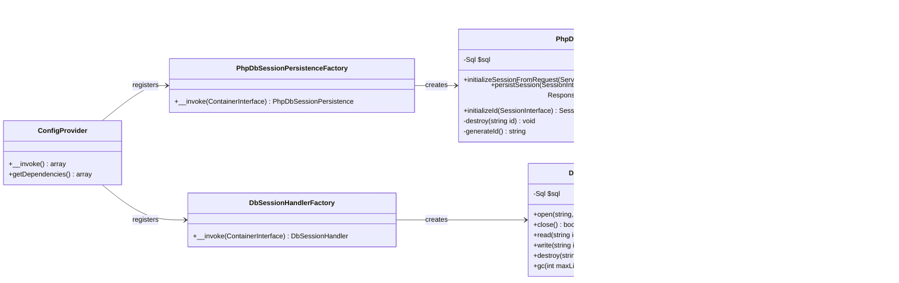

# phpdb-mezzio-session

Database-backed `SessionPersistenceInterface` implementation for Mezzio, built on PhpDb. Designed as an async-safe replacement for `mezzio-session-ext`. Does not use `ext-session`, `$_SESSION`, or any process-global state, making it safe for use in concurrent environments (TrueAsync, Swoole, ReactPHP) as well as the standard PHP built-in server.

---

## 1. Component Overview

### Purpose / Responsibility

- Persists Mezzio sessions in a MySQL `session` table via PhpDb's `AdapterInterface`.
- Reads, writes, and destroys sessions without touching `session_start()` or `$_SESSION`.
- Implements all three standard Mezzio session persistence interfaces: `SessionPersistenceInterface`, `InitializePersistenceIdInterface`, and `SessionCookiePersistenceInterface` (via traits).
- Provides `DbSessionHandler` (`SessionHandlerInterface`) as an alternative entry point for integrations that require PHP's native session handler slot.

### Scope

| In Scope | Out of Scope |
|---|---|
| DB-backed session read / write / destroy / GC | ext-session / `$_SESSION` integration |
| Session ID generation via `random_bytes` | Distributed cache (Redis, Memcached) |
| Cookie header management | Session encryption at rest |
| Response cache-control headers | Multi-database support |
| Async-safe concurrent request handling | Worker process session affinity |

### System Context

```
Browser
  │  Cookie: PHPSESSID=<id>
  ▼
Mezzio Pipeline
  └─ SessionMiddleware (mezzio/mezzio-session)
       │  calls SessionPersistenceInterface
       ▼
  PhpDbSessionPersistence          ← this package
       │  SELECT / INSERT ... ON DUPLICATE KEY UPDATE
       ▼
  MySQL  session  table
```

---

## 2. Architecture

### Design Patterns

- **Adapter** — wraps `PhpDb\Adapter\AdapterInterface`; the concrete driver (MySQL PDO) is injected, not hard-coded.
- **Strategy** — implements `SessionPersistenceInterface`; swappable in the DI container without touching call sites.
- **Factory** — each service has a dedicated `*Factory` class; zero service-locator usage.
- **Template Method** — `CacheHeadersGeneratorTrait` and `SessionCookieAwareTrait` provide shared cookie/header behaviour via composition.

### Component Structure



### Internal Dependencies

| Class | Dependencies |
|---|---|
| `PhpDbSessionPersistence` | `PhpDb\Sql\Sql`, `PhpDb\Adapter\AdapterInterface`, `CacheHeadersGeneratorTrait`, `SessionCookieAwareTrait` |
| `DbSessionHandler` | `PhpDb\Sql\Sql`, `PhpDb\Adapter\AdapterInterface`, `SessionHandlerInterface` |
| `*Factory` classes | `Psr\Container\ContainerInterface`, `PhpDb\Adapter\AdapterInterface` |

### External Dependencies

| Package | Version | Role |
|---|---|---|
| `mezzio/mezzio-session` | `^1.0` | `SessionPersistenceInterface`, `Session`, traits |
| `php-db/phpdb` | `0.4.x-dev` | SQL query builder, adapter |

> `mezzio/mezzio-session-ext` is installed transitively (via `axleus/axleus-message`) but is **not used** by this package. Its `ConfigProvider` alias is overridden by ours when both are registered — register `PhpDb\Session\ConfigProvider` **after** `Mezzio\Session\Ext\ConfigProvider` in `config/config.php`.

---

## 3. Interface Documentation

### `PhpDbSessionPersistence`

Implements `SessionPersistenceInterface` + `InitializePersistenceIdInterface`.

| Method | Parameters | Returns | Notes |
|---|---|---|---|
| `initializeSessionFromRequest` | `ServerRequestInterface $request` | `SessionInterface` | Reads cookie → queries DB with `expires_at > NOW()` → `unserialize()` |
| `persistSession` | `SessionInterface $session`, `ResponseInterface $response` | `ResponseInterface` | Upserts payload, sets cookie + cache headers. No-op if session unchanged. |
| `initializeId` | `SessionInterface $session` | `SessionInterface` | Returns new `Session` with generated ID; no-op if ID already present |

### `DbSessionHandler`

Implements PHP's native `SessionHandlerInterface`. Use this when a third-party library calls `session_set_save_handler()` and you want DB storage without `ext-session` globals.

| Method | Notes |
|---|---|
| `read(string $id)` | Returns payload string or `''`; checks `expires_at > NOW()` |
| `write(string $id, string $data)` | Upserts row; TTL from `session.gc_maxlifetime` |
| `destroy(string $id)` | Deletes by primary key |
| `gc(int $maxLifetime)` | Deletes rows where `expires_at < NOW()`; returns affected row count |

---

## 4. Implementation Details

### Session Lifecycle

```
initializeSessionFromRequest()
  ├─ no cookie          → return Session([], '')           // new anonymous session
  ├─ cookie + DB hit    → return Session($data, $id)       // resume existing
  └─ cookie + DB miss   → return Session([], $id)          // expired; same ID for upsert

persistSession()
  ├─ isRegenerated()    → destroy old row, generateId()    // explicit regeneration
  ├─ id='' + hasChanged → generateId()                     // first write for new session
  ├─ id='' + unchanged  → return $response (no-op)         // discard empty session
  ├─ id set + unchanged → return $response (no-op)         // skip redundant write
  └─ id set + changed   → upsert + Set-Cookie + cache hdrs // normal write path
```

### ID Generation

Session IDs are generated with `bin2hex(random_bytes(16))` — 32 hex characters, 128 bits of CSPRNG entropy. No dependency on `session_id()` or `session_regenerate_id()`.

### Payload Format

Payload is PHP-serialised (`serialize()` / `unserialize()`). Objects stored in session data **must** implement `__serialize()` / `__unserialize()` for correct round-tripping. Primitives and arrays work without any special handling.

### TTL Resolution

TTL is resolved in priority order:
1. `$session->getSessionLifetime()` — if the session implements `SessionCookiePersistenceInterface` and lifetime > 0
2. `ini_get('session.gc_maxlifetime')` — PHP runtime default (typically 1440 s)

### Concurrency Safety

`persistSession()` uses `INSERT ... ON DUPLICATE KEY UPDATE`. Concurrent writes for the same session ID will race at the DB level — the last writer wins. This is the same behaviour as `ext-session` file locking in a non-locking configuration, and is acceptable for typical web session workloads. If strict serializability is required, wrap `persistSession()` in an `Async\protect()` block (TrueAsync) or use DB-level advisory locks.

---

## 5. Schema

```sql
CREATE TABLE IF NOT EXISTS `session` (
    id          VARCHAR(64)  NOT NULL                        COMMENT 'PHP session identifier',
    payload     MEDIUMTEXT   NOT NULL                        COMMENT 'PHP-serialized session data',
    modified_at DATETIME     NOT NULL DEFAULT CURRENT_TIMESTAMP
                             ON UPDATE CURRENT_TIMESTAMP     COMMENT 'Last write timestamp',
    expires_at  DATETIME     NOT NULL                        COMMENT 'Absolute expiry (NOW + gc_maxlifetime)',
    PRIMARY KEY (id),
    INDEX idx_expires_at (expires_at)
) ENGINE=InnoDB DEFAULT CHARSET=utf8mb4 COLLATE=utf8mb4_unicode_ci;
```

`payload` is `MEDIUMTEXT` (up to 16 MB). The `idx_expires_at` index is required for efficient GC — a full-table scan on large session tables is expensive.

The schema is created by `Ims\Migration\Migration015Session` (step 15). See `schema/session.sql` for the standalone DDL.

---

## 6. Usage

### Register in `config/config.php`

```php
// Must come AFTER \Mezzio\Session\Ext\ConfigProvider::class if that is present,
// so that our alias wins the merge.
\Mezzio\Session\ConfigProvider::class,
\PhpDb\Session\ConfigProvider::class,   // ← our package overrides the ext alias
```

### What `ConfigProvider` wires

```php
'aliases' => [
    SessionPersistenceInterface::class => PhpDbSessionPersistence::class,
],
'factories' => [
    DbSessionHandler::class        => DbSessionHandlerFactory::class,
    PhpDbSessionPersistence::class => PhpDbSessionPersistenceFactory::class,
],
```

### Prerequisites

1. `PhpDb\Adapter\AdapterInterface` must be registered in the container (provided by `PhpDb\ConfigProvider` + `PhpDb\Mysql\ConfigProvider`).
2. The `session` table must exist (run `php bin/migrate`).
3. `mezzio/mezzio-session`'s `SessionMiddleware` must be in the pipeline **before** any middleware that reads the session.

### Consuming Sessions in Handlers

Nothing changes for consumers — they use the standard Mezzio session API:

```php
use Mezzio\Session\SessionMiddleware;

$session = $request->getAttribute(SessionMiddleware::SESSION_ATTRIBUTE);
$session->set('user_id', 42);
$userId = $session->get('user_id');
$session->unset('user_id');
```

### Session Regeneration (e.g. on login)

```php
$session = $request->getAttribute(SessionMiddleware::SESSION_ATTRIBUTE);
$session->regenerate(); // old DB row is destroyed; new ID assigned on persist
$session->set('user_id', $user->getId());
```

### Using `DbSessionHandler` (optional)

For libraries that call `session_set_save_handler()` before `session_start()`:

```php
use PhpDb\Session\DbSessionHandler;

$handler = $container->get(DbSessionHandler::class);
session_set_save_handler($handler, true);
session_start();
```

> This is **not** the default path. `PhpDbSessionPersistence` does not use `session_start()` at all.

---

## 7. Quality Attributes

### Security

- Session IDs use `random_bytes(16)` — CSPRNG, not `uniqid()` or `mt_rand()`.
- Expired rows are filtered server-side with `expires_at > NOW()`. An expired cookie is ignored even if the row was not yet GC'd.
- `unserialize()` uses `['allowed_classes' => true]` — full class restoration is intentional since the session may hold value objects. If future sessions store only primitives, tighten to `['allowed_classes' => false]`.
- No payload encryption at rest. If sensitive data is stored in the session, consider encrypting the payload before serialisation at the application layer.

### Async Safety

- No static state, no process globals, no `$_SESSION`.
- `$session->getId()` is called on the live object in `persistSession()` — the persistence object itself carries no per-request state.
- Safe to use under TrueAsync coroutines with shared service instances.

### Performance

- `initializeSessionFromRequest()`: one `SELECT` per request (index scan on primary key).
- `persistSession()`: one `INSERT ... ON DUPLICATE KEY UPDATE` per changed session.
- `idx_expires_at` enables efficient GC deletes without full-table scans.
- Unchanged sessions (`!$session->hasChanged()`) skip the write entirely.

### Reliability

- `ON DUPLICATE KEY UPDATE` is atomic at the InnoDB level — no lost updates from concurrent writes to the same session ID.
- No in-memory cache. Every request reads fresh data from the DB, preventing stale reads in long-lived processes.

---

## 8. Reference

### Configuration Options

There are no package-specific config keys. The following PHP ini values are read at construction time:

| ini key | Used by | Default |
|---|---|---|
| `session.cache_limiter` | `CacheHeadersGeneratorTrait` | `nocache` |
| `session.cache_expire` | `CacheHeadersGeneratorTrait` | `180` |
| `session.name` | `SessionCookieAwareTrait` | `PHPSESSID` |
| `session.cookie_path` | `SessionCookieAwareTrait` | `/` |
| `session.gc_maxlifetime` | TTL calculation | `1440` |

### Dependencies

| Package | Version | Purpose |
|---|---|---|
| `mezzio/mezzio-session` | `^1.0` | Core interfaces and traits |
| `php-db/phpdb` | `0.4.x-dev` | Database adapter and SQL builder |

### Related Files

| Path | Purpose |
|---|---|
| [src/phpdb-mezzio-session/schema/session.sql](../schema/session.sql) | Standalone DDL for the `session` table |
| [src/ims-migration/src/Migration015Session.php](../../ims-migration/src/Migration015Session.php) | Migration that creates the `session` table |
| [config/config.php](../../../config/config.php) | ConfigProvider registration order |

### Troubleshooting

| Symptom | Likely Cause | Fix |
|---|---|---|
| Session not persisted between requests | `SessionMiddleware` not in pipeline | Add `SessionMiddleware::class` to `config/pipeline.php` before auth middleware |
| All sessions empty on every request | `PhpDbSessionPersistence` alias not winning | Check `config/config.php` load order — our `ConfigProvider` must come after `mezzio-session-ext`'s |
| `session` table missing | Migration not run | `php bin/migrate` |
| Objects not deserializing correctly | Class not implementing `__serialize` | Implement `__serialize()` / `__unserialize()` on any class stored in session |
| High DB write load | Too many session writes | Ensure write paths call `$session->set()` only when data changes; unchanged sessions skip the write |
