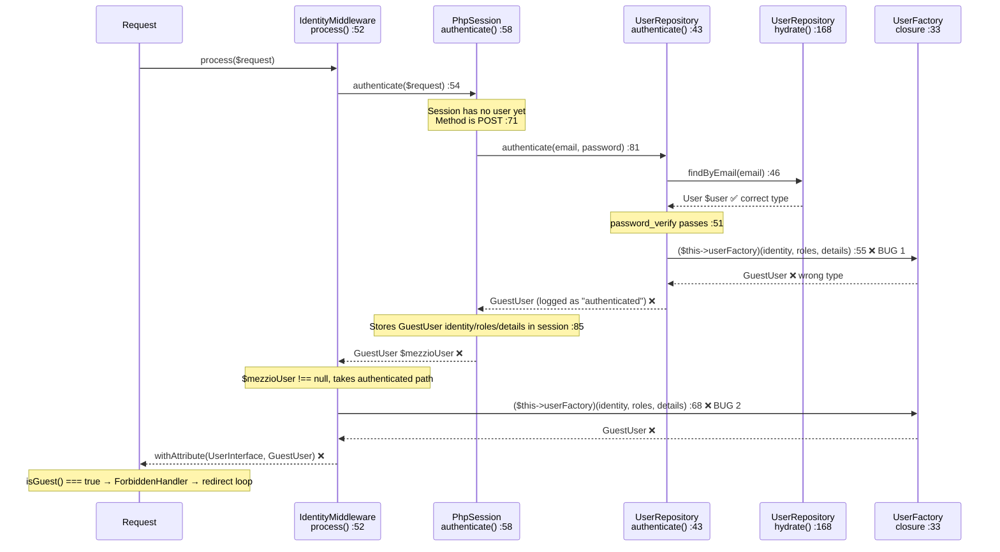
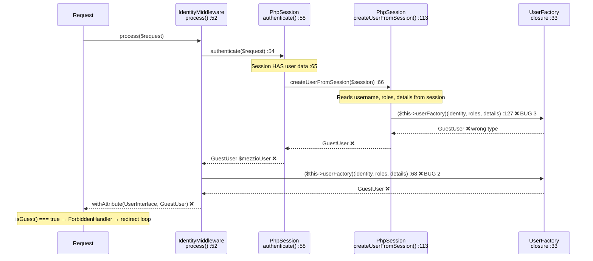

# Identity Resolution Flow — Bug Analysis

## Three Bugs, Two Flows

### Bug Summary

| # | File | Line(s) | Description |
|---|------|---------|-------------|
| 1 | `UserRepository::authenticate()` | 55–59 | Calls `$userFactory` after hydrating a `User` from DB. Destroys the `User` instance and returns a `GuestUser` instead. |
| 2 | `IdentityMiddleware::process()` | 68–73 | For the non-null path, calls `$userFactory` again on the already-resolved user. Even if Bug 1 is fixed, this re-wraps the result as `GuestUser`. |
| 3 | `UserFactory` closure | 33–43 | Always returns `new GuestUser(...)` regardless of identity or roles. |

---

## Flow 1 — Login POST (`POST /user.manager/login`)



---

## Flow 2 — Subsequent Request (Session Restore)



---

## File Reference

### `UserRepository::authenticate()` — Bug 1
**File:** `src/webware-usermanager/src/Repository/UserRepository.php`

```
Line 43:  public function authenticate(string $credential, ?string $password = null): ?UserInterface
Line 45:      $user = $this->findByEmail($credential);       // returns User ✅
Line 47:      if ($user === null || ! $user->active) ...
Line 51:      if (! password_verify(...)) ...
Line 55:      $authenticatedUser = ($this->userFactory)(     // ❌ discards User, wraps as GuestUser
Line 56:          $user->getIdentity(),
Line 57:          $user->getRoles(),
Line 58:          $user->getDetails(),
Line 59:      );
Line 67:      return $authenticatedUser;                      // returns GuestUser ❌
```

**Fix required:** Return `$user` directly. Remove `$userFactory` constructor injection from `UserRepository` and `UserRepositoryFactory`.

---

### `IdentityMiddleware::process()` — Bug 2
**File:** `src/webware-acl/src/Middleware/IdentityMiddleware.php`

```
Line 54:  $mezzioUser = $this->auth->authenticate($request);
Line 56:  if ($mezzioUser === null) {
Line 59:      ($this->userFactory)('Guest', [], [])           // ✅ correct — creates GuestUser for guest
Line 64:  }
Line 65:  return $handler->handle(
Line 67:      $request->withAttribute(
Line 68:          UserInterface::class,
Line 69:          ($this->userFactory)(                        // ❌ BUG 2 — re-wraps $mezzioUser as GuestUser
Line 70:              $mezzioUser->getIdentity(),
Line 71:              $mezzioUser->getRoles(),
Line 72:              $mezzioUser->getDetails(),
Line 73:          ),
```

**Fix required:** For the non-null path, `$mezzioUser` is already the correct type returned by `PhpSession`. Pass it directly to `withAttribute` without calling the factory.

---

### `UserFactory` closure — Bug 3 (affects session restore only)
**File:** `src/webware-usermanager/src/Container/UserFactory.php`

```
Line 33:  return static function (
Line 34:      string $identity,
Line 35:      array $roles = [],
Line 36:      array $details = [],
Line 37:  ): UserInterface {
Line 41:      return new GuestUser($identity, $roles ?: [GuestUser::GUEST_ROLE], $details); // ❌ always GuestUser
Line 42:  };
```

This factory is called by `PhpSession::createUserFromSession()` (vendor — cannot change) on every non-login request. With Bugs 1 and 2 fixed, this path must return the correct type. Since `User` cannot be constructed from `(identity, roles, details)` alone, this requires a decision on the session-restore strategy.

---

## Dependency Chain

```
UserRepositoryFactory (line 35)
  └─ injects Mezzio\Authentication\UserInterface::class as $userFactory
       └─ aliased → Webware\UserManager\UserInterface::class
            └─ resolved by UserFactory::__invoke()
                 └─ returns closure that always creates GuestUser
```

Both `UserRepository` and `IdentityMiddleware` receive this same callable. Both call it. The result is always `GuestUser`.
