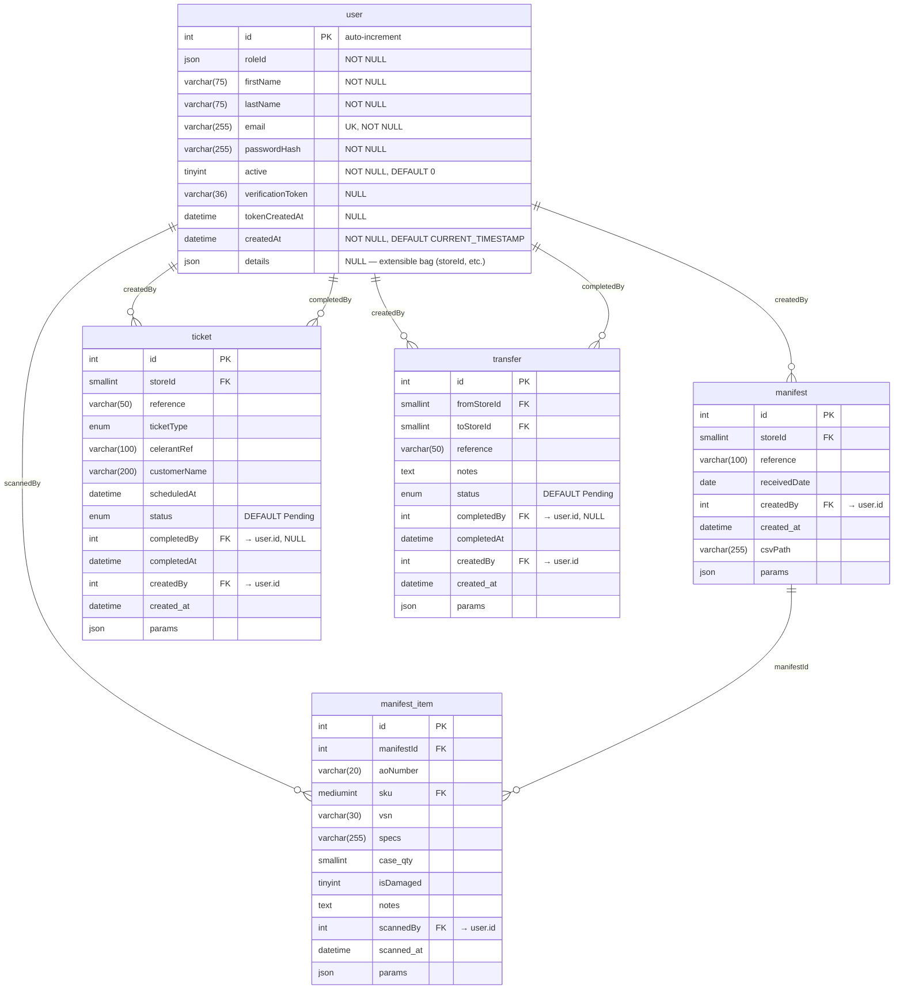

# `user` Table Schema

> Generated 2026-06-13 from live database via PhpDb MCP.

## Entity-Relationship Diagram

## Column Details

| Column | Type | Nullable | Default | Notes |
|---|---|---|---|---|
| `id` | `INT(10) UNSIGNED` | ❌ | auto-increment | Primary key |
| `roleId` | `JSON` | ❌ | — | Array of role identifiers |
| `firstName` | `VARCHAR(75)` | ❌ | — | |
| `lastName` | `VARCHAR(75)` | ❌ | — | |
| `email` | `VARCHAR(255)` | ❌ | — | Unique constraint `uq_user_email` |
| `passwordHash` | `VARCHAR(255)` | ❌ | — | |
| `active` | `TINYINT(3)` | ❌ | `0` | Boolean flag |
| `verificationToken` | `VARCHAR(36)` | ✅ | `NULL` | |
| `tokenCreatedAt` | `DATETIME` | ✅ | `NULL` | |
| `createdAt` | `DATETIME` | ❌ | `CURRENT_TIMESTAMP` | |
| `details` | `JSON` | ✅ | `NULL` | Extensible bag — store-scoped fields (`storeId`, etc.) live here |

## Constraints

| Name | Type | Columns |
|---|---|---|
| `_laminas_user_PRIMARY` | PRIMARY KEY | `id` |
| `_laminas_user_uq_user_email` | UNIQUE | `email` |

## Foreign Key References (inbound)

`user` has **no outbound** foreign keys. The following tables reference `user(id)`:

| Referencing Table | Column | Constraint | ON DELETE |
|---|---|---|---|
| `manifest` | `createdBy` | `fk_manifest_created_by` | NO ACTION |
| `manifest_item` | `scannedBy` | `fk_mi_scanned_by` | NO ACTION |
| `ticket` | `createdBy` | `fk_ticket_created_by` | NO ACTION |
| `ticket` | `completedBy` | `fk_ticket_completed_by` | NO ACTION |
| `transfer` | `createdBy` | `fk_xfer_created_by` | NO ACTION |
| `transfer` | `completedBy` | `fk_xfer_completed_by` | NO ACTION |

## Notes

- **`storeId` is not a column** on `user`. On the old `ims-store` entity it was a first-class property; it now lives inside the JSON `details` column and is accessed via `getDetail('storeId')` by consumers that need store-scoping (e.g., ACL ownership assertions).
- All inbound FKs use `ON DELETE NO ACTION` — users cannot be deleted while referenced by manifests, manifest items, tickets, or transfers.
- The `roleId` column stores roles as a JSON array (e.g., `["Member", "Warehouse"]`). The entity's `getRoles()` and `getRoleId()` methods derive from this field.
